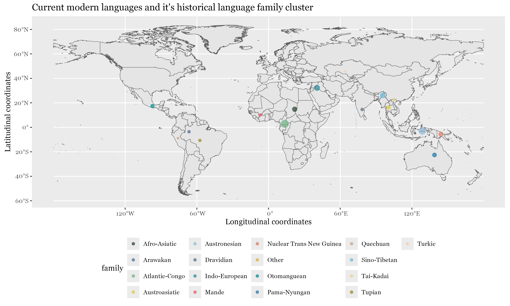
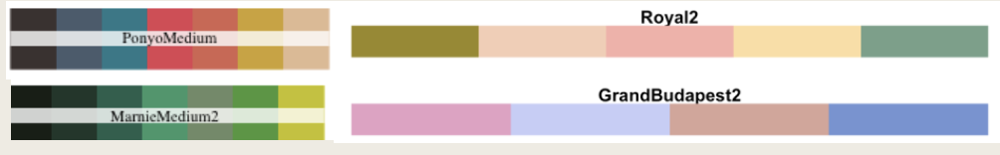

## Description
A geographic map of the world currently (with country borders from ArcGIS's generalized world countries) plotted with clusters of current world's languages and its language families and where it is primarily used. 

This visualization is designed for a general audience ranging from linguistics students and geography enthusiasts to data science peers and casual learners. This is a static bubble map that shows the top 16 language families as bubble clusters. I loved the color palettes of Studio Ghibli but it was limited to only 7 and the colors were too close to one another that there wasn't enough distinction. So I chose colors from various color palettes in both Studio Ghibli and Wes Anderson to create my own. 

## What am I trying to show
I am trying to show the history of languages and what language families came from. I originally got this idea as I love learning languages, but so far I have only stuck with Sino-Tibetan languages and Indo-european and wanted to branch out and see what other languages there were for me to learn. Little did I know there were 8000+ languages ranging from extinct to widely spoken. 

## How I created it :)
The dataset used is sourced from Kaggle and Glottolog, a comprehensive linguistic database that catalogs the world's languages. 
The first dataset had only 12 linguistic families
Second dataset contains over 8,000 languages with variables including language name, language family, macroarea, geographic coordinates, ISO 639-3 code, country codes, and endangerment status (https://www.kaggle.com/datasets/ibrahimqasimi/languages-of-the-world-8612-languages). 
The original dataset I was using to distinguish the languages was not accurate. I had to find another dataset through https://glottolog.org/ + kaggle, which is the registry for all languages in the world. I initially had 12 language families, but with the new dataset, it now has 247, so up to my discretion, I kept my top 16 and listed everything else as other. 
A map was created from a ArcGis's World Map generalized map. Bubble points were created averaging the latitude and longitude from each language and its language family and plotting the top 16 families by count. 

## Interactive App
### How to read it
As a person seeing this map for the first time, start by selecting a language and a map will pop up with colors. The color corresponds to the first family selected. If you were to select a second family, a second color would pop up and so on and so forth. You are then able to zoom in and see what each individual cluster is, and also at a glance see where clusters of languages and its respective family are geographically. 

This is the interactive map that I have created from this project. I have created it so that you are able to select more than one language family at once (with my color palette) and be able to zoom in to see what each dot's information means. 

<iframe src="https://persimmons.shinyapps.io/language_app/" 
        width="100%" 
        height="700px"
        frameborder="0">
</iframe>